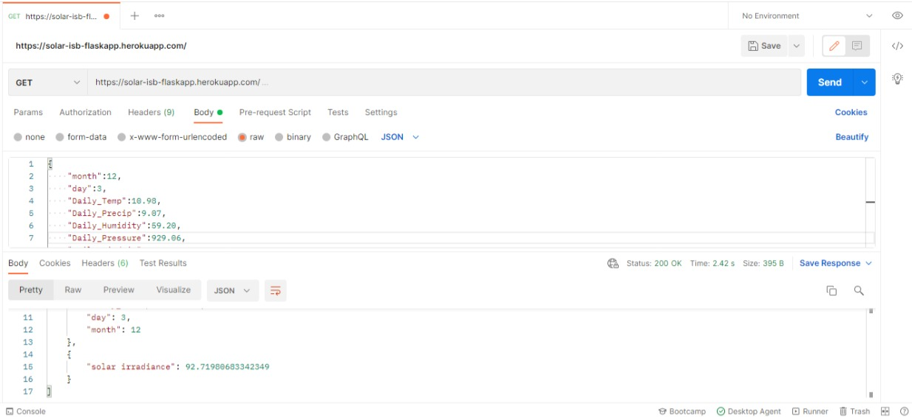
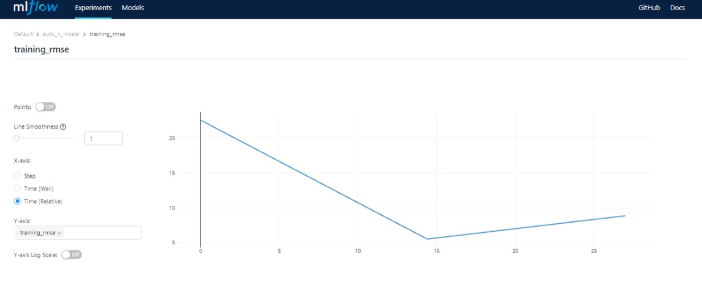
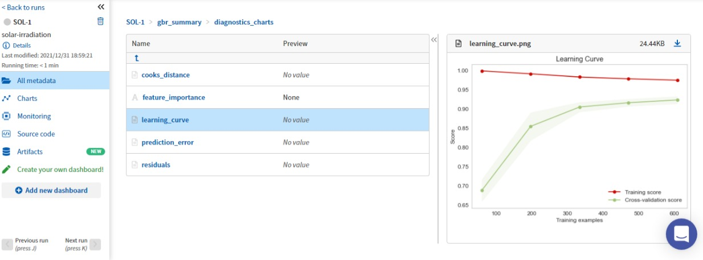

# End-to-End Machine Learning of Historical Solar Radiation for Islamabad

Link: https://solar-isb-flaskapp.herokuapp.com/


Flask app to predict daily radiation from the time series of Solcast from Islamabad, Pakistan.

Input: `month`, `day`, `Daily_Temp`, `Daily_Precip`, `Daily_Humidity`, `Daily_Pressure`, `Daily_WindDir`, `Daily_WindSpeed`, `Daily_DNI`, `Daily_GHI`
Output: `Daily_radiation`

## Use Json Input

```json
{
    "month":12,
    "day":3,
    "Daily_Temp":10.98,
    "Daily_Precip":9.07,
    "Daily_Humidity":59.20,
    "Daily_Pressure":929.06,
    "Daily_WindDir":167.30,
    "Daily_WindSpeed":1.86,
    "Daily_DNI":522.20,
    "Daily_GHI":324.60
}
```

## Results
```
[
    {
        "Daily_DNI": 522.2,
        "Daily_GHI": 324.6,
        "Daily_Humidity": 59.2,
        "Daily_Precip": 9.07,
        "Daily_Pressure": 929.06,
        "Daily_Temp": 10.98,
        "Daily_WindDir": 167.3,
        "Daily_WindSpeed": 1.86,
        "day": 3,
        "month": 12
    },
    {
        "solar irradiance": 92.71980683342349
    }
]
```

### Postman

### Mlflow

### NeptuneAI

